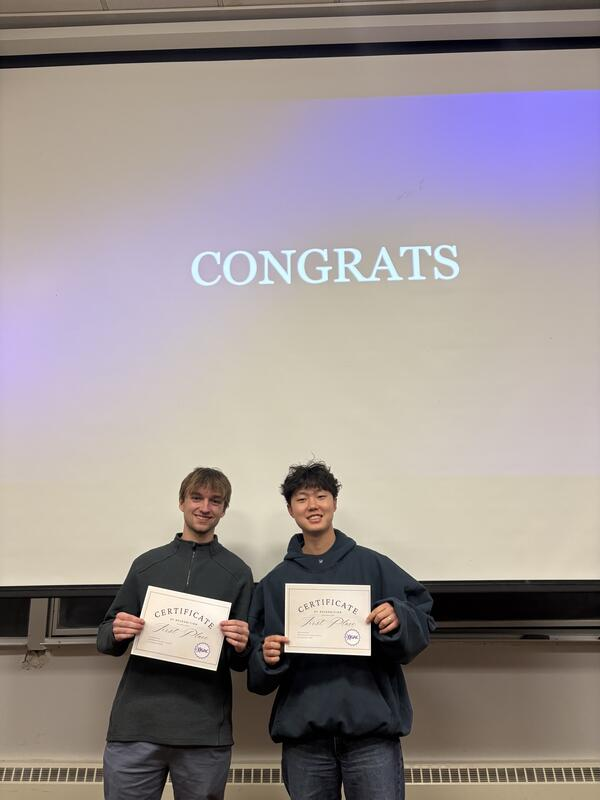
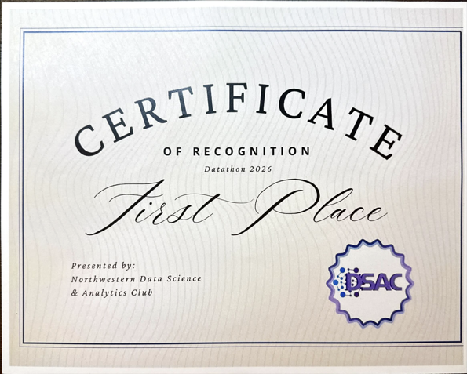

# Philadelphia Burger Ratings | Northwestern DSAC Datathon 2026

**First Place - Northwestern Data Science & Analytics Club (DSAC) Datathon 2026**

An end-to-end analysis of Yelp data that turns thousands of Philadelphia restaurant reviews into practical guidance for burger restaurants. The project combines scalable data preparation with interpretable machine learning to answer a simple business question: **what experiences are most closely associated with stronger customer ratings?**

## Why it matters

Restaurant owners need more than an average star rating - they need to know where to focus. We analyzed review text and restaurant-level data to identify recurring drivers of customer sentiment, with an emphasis on actionable areas such as service, wait time, food quality, value, cleanliness, and atmosphere.

## What we built

| Area | Deliverable | Value |
| --- | --- | --- |
| Data engineering | A review-level Yelp dataset joining business, user, check-in, tip, and review data | Creates a unified foundation for restaurant analysis at scale |
| Market analysis | Restaurant-category and Philadelphia neighborhood analyses | Surfaces variation across cuisines and areas for expansion or benchmarking |
| Machine learning | TF-IDF + Ridge regression model for burger-review rating prediction | Quantifies how review language relates to star ratings |
| Interpretation | Keyword-topic analyses and visualizations | Translates model output into operational priorities |

## Key takeaways

- Negative customer experiences are more consequential than positive mentions, making reliable service recovery and operational consistency especially important.
- Service quality and burger quality emerged as prominent themes associated with ratings.
- The analysis separates prediction from interpretation: the text model estimates ratings, while topic features make the likely business levers easier to discuss.
- Findings are directional and observational; review language shows association, not causation.

## Project structure

- [Machine learning analysis](Machine_Learning/README.md) - model approach, outputs, and how to reproduce the burger-review analysis.
- [Yelp review analysis](Yelp_Reviews_Analysis/README.md) - data-pipeline and exploratory-analysis workflow.
- [Data presentation](assets/Data-Presentation.pdf) - competition presentation (PDF).
- [DSAC award certificate](assets/DSAC-Award.pdf) - First Place certificate (PDF).

## Recognition

  
   
  <strong>Award Ceremony</strong>

  
   
  <strong>Award</strong> - <a href="assets/DSAC-Award.pdf">View the DSAC Award certificate (PDF)</a>

## Technical stack

Python, pandas, scikit-learn, matplotlib, and Yelp Open Dataset CSV files.

## Reproducing the work

The source code is included, but the Yelp CSV files are excluded because of their size. See the component READMEs for expected data locations and run order. Install the required Python packages in your environment, place the source files in the specified data folder, then run the scripts from their respective directories.

## Team

Northwestern University students | DSAC Datathon 2026
